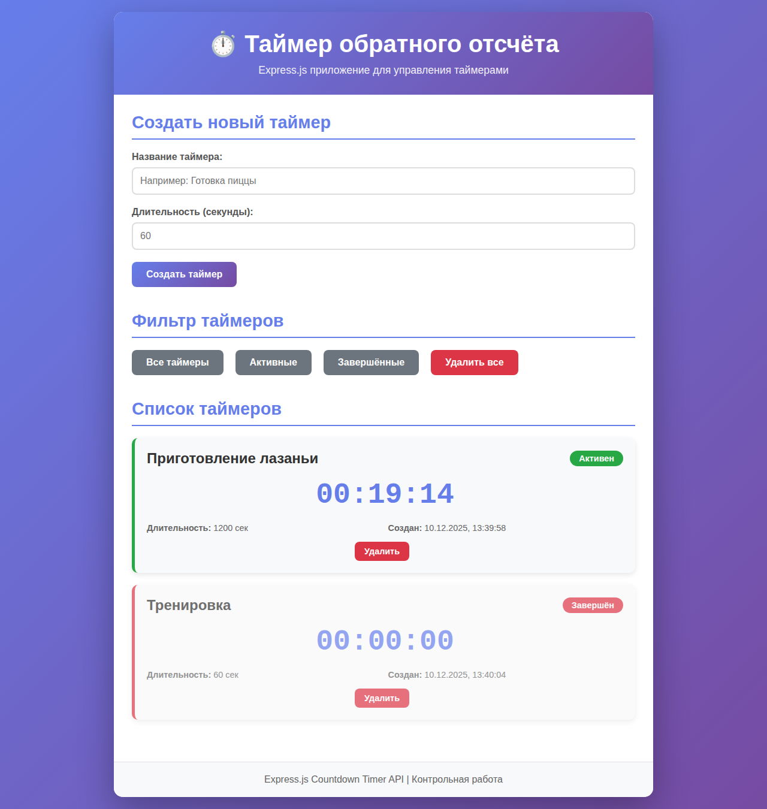
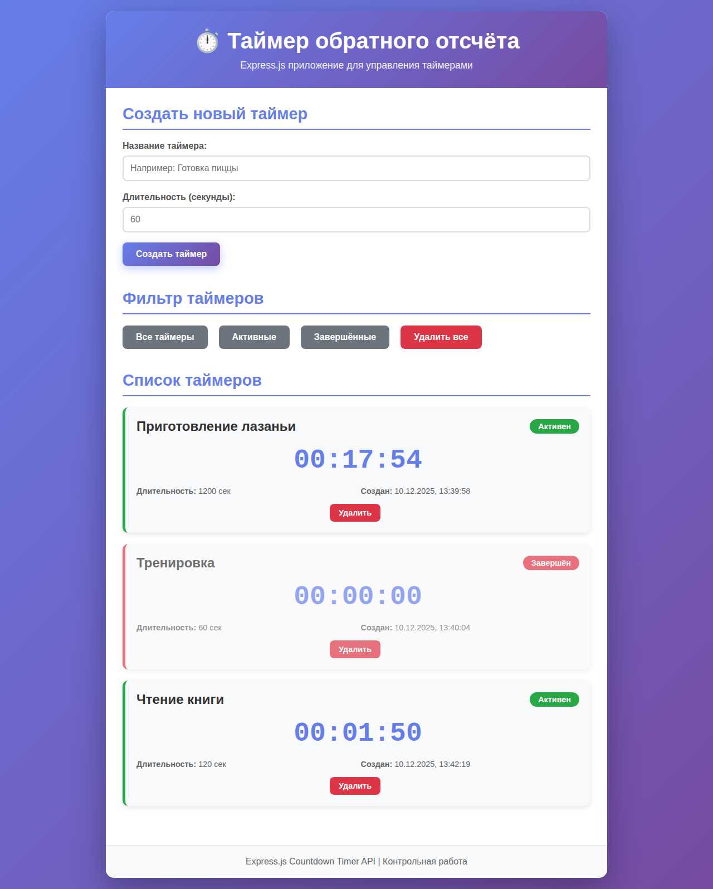
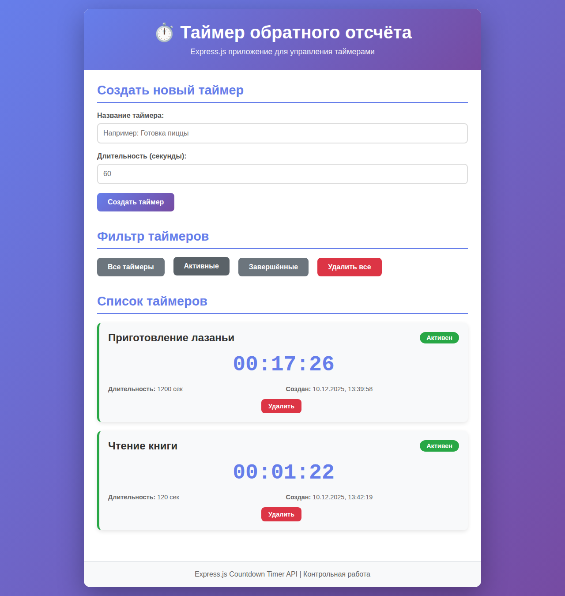

# TIP-KR5 - Таймер обратного отсчёта

Express.js приложение для управления таймерами обратного отсчёта. Контрольная работа по Express.js.

## 📋 Описание проекта

Полнофункциональное веб-приложение на Express.js, которое позволяет создавать, управлять и отслеживать таймеры обратного отсчёта. Приложение демонстрирует все ключевые концепции Express.js:

- ✅ Базовый Express сервер
- ✅ REST API с маршрутами (GET, POST, PUT, DELETE)
- ✅ Работа с параметрами (req.params, req.query)
- ✅ Обработка тела запроса (express.json(), express.urlencoded())
- ✅ Собственные middleware (логирование и валидация)
- ✅ Раздача статических файлов (express.static())
- ✅ Модульная структура (routes + controllers)

## 🚀 Установка и запуск

### Требования
- Node.js (версия 14 или выше)
- npm

### Установка зависимостей
```bash
npm install
```

### Запуск сервера
```bash
npm start
```

Сервер будет доступен по адресу: `http://localhost:3000`

## 📁 Структура проекта

```
TIP-KR5/
├── public/                 # Статические файлы
│   ├── css/
│   │   └── style.css      # Стили приложения
│   ├── js/
│   │   └── app.js         # Frontend логика
│   └── index.html         # Главная страница
├── src/
│   ├── controllers/
│   │   └── timerController.js  # Бизнес-логика таймеров
│   ├── middleware/
│   │   ├── logger.js      # Middleware для логирования
│   │   └── validator.js   # Middleware для валидации
│   └── routes/
│       └── timerRoutes.js # API маршруты
├── server.js              # Главный файл сервера
├── package.json
└── README.md
```

## 🔌 API Endpoints

### Получить информацию об API
```
GET /api
```

### Получить все таймеры
```
GET /api/timers
```
Query параметры:
- `active=true` - только активные таймеры
- `active=false` - только завершённые таймеры

**Пример запроса:**
```bash
curl http://localhost:3000/api/timers?active=true
```

**Пример ответа:**
```json
{
  "success": true,
  "count": 2,
  "data": [
    {
      "id": 1,
      "name": "Готовка пиццы",
      "duration": 900,
      "startTime": 1702214400000,
      "endTime": 1702215300000,
      "createdAt": "2024-12-10T10:00:00.000Z"
    }
  ]
}
```

### Получить таймер по ID
```
GET /api/timers/:id
```

**Пример запроса:**
```bash
curl http://localhost:3000/api/timers/1
```

**Пример ответа:**
```json
{
  "success": true,
  "data": {
    "id": 1,
    "name": "Готовка пиццы",
    "duration": 900,
    "startTime": 1702214400000,
    "endTime": 1702215300000,
    "createdAt": "2024-12-10T10:00:00.000Z",
    "remainingTime": 450000,
    "isActive": true
  }
}
```

### Создать новый таймер
```
POST /api/timers
Content-Type: application/json
```

**Тело запроса:**
```json
{
  "name": "Готовка пиццы",
  "duration": 900
}
```

**Пример запроса:**
```bash
curl -X POST http://localhost:3000/api/timers \
  -H "Content-Type: application/json" \
  -d '{"name":"Готовка пиццы","duration":900}'
```

**Пример ответа:**
```json
{
  "success": true,
  "message": "Timer created successfully",
  "data": {
    "id": 1,
    "name": "Готовка пиццы",
    "duration": 900,
    "startTime": 1702214400000,
    "endTime": 1702215300000,
    "createdAt": "2024-12-10T10:00:00.000Z"
  }
}
```

### Обновить таймер
```
PUT /api/timers/:id
Content-Type: application/json
```

**Тело запроса:**
```json
{
  "name": "Готовка лазаньи",
  "duration": 1200
}
```

**Пример запроса:**
```bash
curl -X PUT http://localhost:3000/api/timers/1 \
  -H "Content-Type: application/json" \
  -d '{"name":"Готовка лазаньи","duration":1200}'
```

### Удалить таймер
```
DELETE /api/timers/:id
```

**Пример запроса:**
```bash
curl -X DELETE http://localhost:3000/api/timers/1
```

### Удалить все таймеры
```
DELETE /api/timers
```

**Пример запроса:**
```bash
curl -X DELETE http://localhost:3000/api/timers
```

## 🛠️ Middleware

### Logger
Пользовательский middleware для логирования HTTP запросов:
- Логирует метод, URL, IP адрес и временную метку
- Применяется ко всем запросам

### Validator
Пользовательский middleware для валидации данных таймера:
- Проверяет наличие и корректность поля `name`
- Проверяет наличие и корректность поля `duration`
- Применяется к POST и PUT запросам

## 💡 Особенности реализации

1. **Модульная архитектура**: Код организован по принципу разделения ответственности (routes, controllers, middleware)

2. **RESTful API**: Полноценный REST API с поддержкой всех основных HTTP методов

3. **Валидация данных**: Проверка входящих данных перед обработкой

4. **Логирование**: Автоматическое логирование всех HTTP запросов

5. **Интерактивный UI**: Красивый веб-интерфейс для работы с таймерами

6. **Real-time обновление**: Таймеры обновляются в реальном времени на клиенте

## 📸 Скриншоты

### Главная страница


### Создание таймера


### Список таймеров


## 🧪 Тестирование API

Вы можете протестировать API с помощью curl, Postman или любого другого HTTP клиента.

### Пример сценария тестирования:

1. Создать таймер на 60 секунд:
```bash
curl -X POST http://localhost:3000/api/timers \
  -H "Content-Type: application/json" \
  -d '{"name":"Тест таймер","duration":60}'
```

2. Получить все таймеры:
```bash
curl http://localhost:3000/api/timers
```

3. Получить только активные таймеры:
```bash
curl http://localhost:3000/api/timers?active=true
```

4. Получить конкретный таймер:
```bash
curl http://localhost:3000/api/timers/1
```

5. Удалить таймер:
```bash
curl -X DELETE http://localhost:3000/api/timers/1
```

## 📝 Требования выполнены

- ✅ Базовый Express-сервер
- ✅ Маршруты (GET, POST, PUT, DELETE)
- ✅ Работа с req.params и req.query
- ✅ Обработка тела запроса через express.json() и express.urlencoded()
- ✅ Собственные middleware (logger и validator)
- ✅ Раздача статических файлов через express.static()
- ✅ Модульная структура (routes + controllers)
- ✅ Структурированный репозиторий с README

## 👨‍💻 Автор

Контрольная работа по Express.js

## 📄 Лицензия

ISC